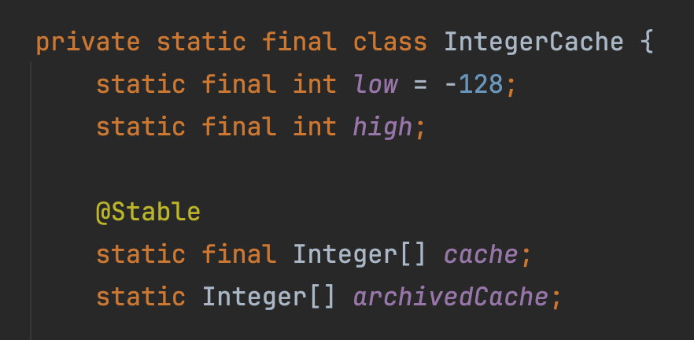

## 2주차 미션 회고 - 로또

- [리뷰1](https://github.com/next-step/kotlin-lotto/pull/1019)
- [리뷰2](https://github.com/next-step/kotlin-lotto/pull/1039)
- [리뷰3](https://github.com/next-step/kotlin-lotto/pull/1084)
- [리뷰4](https://github.com/next-step/kotlin-lotto/pull/1110)

## 객체지향 어려운걸?

이번 미션을 진행하면서 가장 많이 받았던 피드백은 "A클래스에서 B클래스로 책임을 위임해보는건 어떨까요?" 였다.  
코드를 작성할때는 분명 잘 나눴다고 생각했는데, 리뷰어님의 피드백을 받고 다시보니 아쉬운 부분들이 눈에 보이기 시작했다.

객체지향은 단순히 사이즈가 큰 클래스를 나누고 메서드를 쪼개는 행위가 아니다. "적절한 객체에게 적절한 책임을 부여" 할 수 있어야 한다. 연습을 위한 과제들이기 때문에 이 기간만큼은 조금 과하다고 느껴지더라도 최대한 원칙에 맞춰서 코드를 작성해보고자 한다.

**<객체 설계가 어려울때 시도해볼것들>**

- 최상위 함수에서 모든 기능을 구현하고 하나씩 리팩토링을 통해 분리해볼것.
- 너무 추상적이라고 느껴지면 정량적인 지표를 바탕으로 해볼것. e.g) 객체생활체조원칙
- 기능목록을 작성하고 이를 테스트코드로 옮겨볼것.

#### Kotlin의 Int와 Java의 Int (동등성/동일성 비교를 곁들인)

Kotlin은 기본적으로 모든 타입들에 대해 null-safety하다. 명시적으로 nullable하다고 표시해야 null을 할당할 수 있다. 반면 Java의 경우 Integer 타입에는 숫자 혹은 null이 모두 할당이 가능하다.

아래의 코드는 자바로 변환되면 모두 기본 타입인 int로 변환된다.

```kotlin
val num1: Int = 1 	// -> int num1 = 1
val num2: Int = 1	// -> int num2 = 1

val num1: Int = 1000	// -> int num1 = 1000
val num2: Int = 1000	// -> int num2 = 1000
```

그렇다면 다음 코드는 어떻게 될까?

```kotlin
val num1: Int? = 1 	// -> Integer num1 = 1
val num2: Int? = 1	// -> Integer num2 = 1

val num1: Int? = 1000 	// -> Integer num1 = 1000
val num2: Int? = 1000	// -> Integer num2 = 1000
```

Java에서 기본타입에 null이 허용되지 않기 때문에 Integer 타입으로 변환된다.

(번외) 그렇다면 위의 변환된 결과에 대해 동등성 / 동일성 비교를 한다면?

```kotlin
val num1: Int? = 1
val num2: Int? = 1

num1 shouldBe num2			//true
num1 shouldBeSameInstanceAs num2	// true

//----------------------------------------------

val num1: Int? = 1000
val num2: Int? = 1000

num1 shouldBe num2			//true
num1 shouldBeSameInstanceAs num2	// false
```

분명 두가지 케이스 모두 Java로 변환되면 같은 Integer 타입의 인스턴스가 된다. 하지만 위에는 동일성까지 모두 통과하는 반면 아래는 동등성만 통과한다. 이렇게 되는 이유는 Integer 클래스에서 캐시를 지원하기 때문이다. -128~127까지의 숫자에 대해서는 캐시를 가지고 있기 때문에 동일한 인스턴스로 여겨지지만 해당 범위를 벗어나면 그때부터는 각각 새로운 인스턴스가 생성된다.



## 추가적으로 배운 내용

- KotlinDSL
- 불변 객체가 가지는 장점 ([불변 객체 만들기 연습 repo](https://github.com/Seokho-Ham/edu-concert-immutable))

## 정리해야하는 내용

- 객체지향.. (과정을 진행하는동안 오브젝트를 읽어보자.)
- SealedClass, SealedInterface
- "Kotlin은 예외를 던지는것 보다는 null을 반환하는게 더 낫다?" 에 대해
