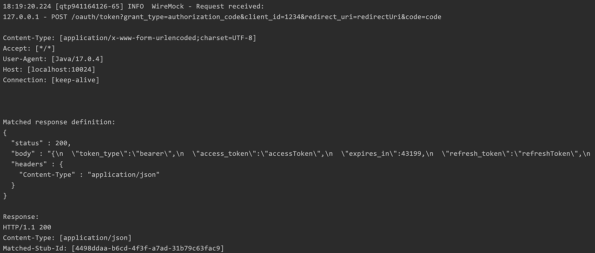

> 지난 Feign Client 적용기에 이어서 WireMock을 이용한 테스트 경험을 소개합니다.

## 서론

이번 프로젝트에서는 기능 개발 시 인수테스트, 통합테스트, 단위테스트를 먼저 작성하고 개발을 진행하려고 노력하고 있습니다. 저는 OAuth 로그인 기능을 맡았고 해당 기능에 대한 인수테스트를 작성하는 과정에서 **"어떻게하면 외부 api에 대해 실제 상황에 가까운 테스트를 할 수 있을지"**에 대해 고민하게 되었습니다.

일반적으로 사용되는 Mockito를 사용하여 테스트를 진행할 수 있었지만 이 방식은 한계가 있다고 느꼈습니다. 외부 api를 사용할때는 http 요청과 응답, 응답값에 대한 역직렬화 과정 등이 발생하는데 Mockito는 단순히 목객체를 주입받아서 메서드를 호출하는 방식으로 동작하기 때문입니다.

그렇다고 실제 카카오 Api를 호출해서 테스트할수도 없는 노릇이었습니다. 그렇게 되면 카카오 서버의 상태에 따라 테스트의 성공 여부가 달려있게 되기 때문입니다.

그래서 다른 방법을 찾던 중 WireMock이라는 라이브러리를 발견하게 되었습니다.

## Wiremock이란?

Wiremock이란 Http 기반의 api 서비스를 모킹하는 용도로 제공되는 목 서버 라이브러리입니다.

여기서 중요한것은 목서버를 제공한다는 점인데, 지정해둔 uri로 요청이 발생할 경우 목서버로 http 요청이 발생하고 미리 지정해둔 형태의 http 응답이 반환됩니다.

Wiremock을 사용하게 되면 실제 외부 api에 의존하지 않으면서 http 요청/응답을 통한 테스트가 가능해집니다. 또한 외부 서버가 아닌 로컬에 서버를 띄워 사용하기 때문에 속도도 빠릅니다. 이런 이유들로 현재 작성하는 테스트에 적용하기 적합하다고 판단되어 적용하게 되었습니다.

## 적용

Wiremock은 2가지 방식으로 사용이 가능합니다.

- jar 파일을 받아서 독립적인 서버로 운영하는 방식
- build.gradle 의존성을 사용하여 JUnit 테스트에서만 운영하는 방식  
  이 방식을 사용하게 되면 JUnit이 Wiremock 서버의 생명주기를 관리합니다.

현재 프로젝트에서는 OAuth 인수테스트에서만 사용하기 때문에 2번째 방법을 사용했으며 기본 wiremock 의존성이 아닌, **spring-cloud에서 제공되는 의존성을 사용**했습니다.

#### 1. 가장 먼저 build.gradle에 Wiremock 관련 의존성을 추가했습니다.

```groovy
1. 가장 먼저 build.gradle에 Wiremock 관련 의존성을 추가했습니다.
```

#### 2. 목 서버가 필요한 테스트 위에 @AutoConfigureWireMock 어노테이션을 붙여주었습니다.

(해당 어노테이션을 목서버가 필요한 테스트 클래스 위해 붙여야 Application Context가 뜰때 목서버가 빈으로 등록됩니다.)

- 랜덤한 포트를 사용하도록 하기 위해서 0으로 설정했습니다.
  - 목서버의 포트는 default로 8080이 세팅되어 있으며 0으로 설정하면 랜덤한 포트를 사용합니다.
- 실제 feign client가 요청을 보내게 되는 uri를 목서버의 uri로 동적으로 변경하기 위해서 properties 설정을 바꾸어주었습니다.

```java
@AutoConfigureWireMock(port = 0)
@TestPropertySource(properties = {
    "oauth.kakao.service.token_url=http://localhost:${wiremock.server.port}",
    "oauth.kakao.service.api_url=http://localhost:${wiremock.server.port}"
})
@DisplayName("OAuth 로그인 인수테스트")
class OAuthLoginAcceptanceTest extends InitAcceptanceTest { ... }
```

#### 3. 다음으로는 요청이 들어올 path와 요청에 대한 http 응답을 지정해주었습니다.

기본적으로 wiremock은 src/test/resources/mappings 경로에 있는 json 파일을 읽어서 stub를 설정합니다

- 여기서 stub이란 http 요청 path와 그에 대한 http 응답을 설정해서 제공하는것을 의미합니다.

```json
{
  "request": {
    "url": "/resource",
    "method": "POST",
    "bodyPatterns": [
      {
        "matchesJsonPath": "$.id"
      }
    ]
  },
  "response": {
    "status": 200,
    "body": "Hello World",
    "headers": {
      "X-Application-Context": "application:-1",
      "Content-Type": "text/plain"
    }
  }
}
```

하지만 저는 목서버를 사용하는 곳에서 명시적으로 stub를 세팅해주기 위해 응답값만 json 파일로 만들어두고 OAuthMock이라는 객체를 만들어서 메서드 내에서 stub를 설정했습니다.

- 응답값은 file:src/test/resources/payload 경로에 json 파일 형태로 만들었습니다.

```json
//token-response
{
  "token_type":"bearer",
  "access_token":"accessToken",
  "expires_in":43199,
  "refresh_token":"refreshToken",
  "refresh_token_expires_in":25184000,
  "scope":"account_email profile"
}

//user-response
{
  "id": 123456789,
  "kakao_account": {
    "profile_needs_agreement": false,
    "profile": {
      "nickname": "홍길동",
      "thumbnail_image_url": "http://yyy.kakao.com/.../img_110x110.jpg",
      "profile_image_url": "http://yyy.kakao.com/dn/.../img_640x640.jpg",
      "is_default_image": false
    },
    "name_needs_agreement": false,
    "name": "홍길동",
    "email_needs_agreement": false,
    "is_email_valid": true,
    "is_email_verified": true,
    "email": "sample@sample.com",
    "age_range_needs_agreement": false,
    "age_range": "20~29",
    "birthday_needs_agreement": false,
    "birthday": "1130",
    "gender_needs_agreement": false,
    "gender": "female"
  }
}
```

아래는 실제 stub를 세팅하는 코드입니다.
메서드 내에서 사용한 stubfor, post 등등의 메서드는 모두 WireMock 클래스에서 제공되는 메서드들입니다.

```java
public class OAuthMocks {

    public static void setUpResponses() throws IOException {
        setupMockTokenResponse();
        setupMockUserInfoResponse();
    }

    public static void setupMockTokenResponse() throws IOException {
        stubFor(post(urlEqualTo("/oauth/token?grant_type=authorization_code&client_id=1234&redirect_uri=redirectUri&code=code"))
                .willReturn(aResponse()
                        .withStatus(HttpStatus.OK.value())
                        .withHeader("Content-Type", MediaType.APPLICATION_JSON_VALUE)
                        .withBody(getMockResponseBodyByPath("payload/get-token-response.json"))
                )
        );
    }

    public static void setupMockUserInfoResponse() throws IOException {
        stubFor(get(urlEqualTo("/v2/user/me"))
                .withHeader("Authorization", equalTo("bearer accessToken"))
                .willReturn(aResponse()
                        .withStatus(HttpStatus.OK.value())
                        .withHeader("Content-Type", MediaType.APPLICATION_JSON_VALUE)
                        .withBody(getMockResponseBodyByPath("payload/get-user-info-response.json"))
                )
        );
    }

    ...
}
```

#### 4. 이후 실제 사용하는 테스트에서 OAuthMock객체의 메서드를 사용해서 stub를 설정했습니다.

```java
@DisplayName("OAuth 로그인 인수테스트")
class OAuthLoginAcceptanceTest extends InitAcceptanceTest {

    @BeforeAll
    static void setWireMockResponse() throws IOException {
        OAuthMocks.setUpResponses();
    }

    ...

}
```

위의 순서대로 세팅을 마치고 테스트를 실행했을때 아래와 같은 로그가 찍힙니다.

- 목서버로 온 http 요청
- 요청에 일치하는 stub
- http 응답



## 마무리

인수테스트는 사용자의 요청 흐름에 맞춰 테스트를 작성합니다.

그렇기 때문에 실제 api 호출 시의 환경에 보다 가까운 테스트를 작성할 수 있어야 한다고 생각합니다. 하지만 이때 로직에 외부 api가 껴있다면 테스트하기가 까다로워지는데 이런 어려움을 해결하기에 Wiremock은 좋은 선택이 될 수 있는것 같습니다.

## 참고자료

- [wiremock 공식문서](https://wiremock.org/docs/)
- [spring-cloud-wiremock-docs](https://cloud.spring.io/spring-cloud-contract/2.0.x/multi/multi__spring_cloud_contract_wiremock.html)
- [geeks-for-geeks : wiremock vs mockito](https://www.geeksforgeeks.org/wiremock-vs-mockito/)
